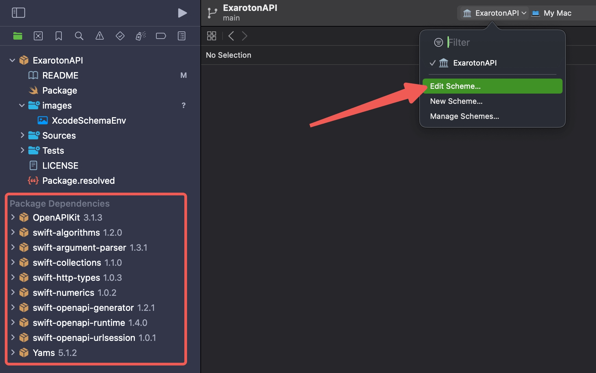
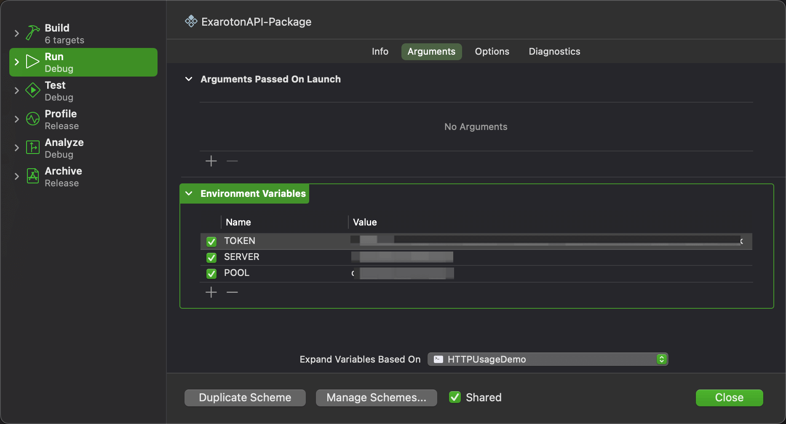
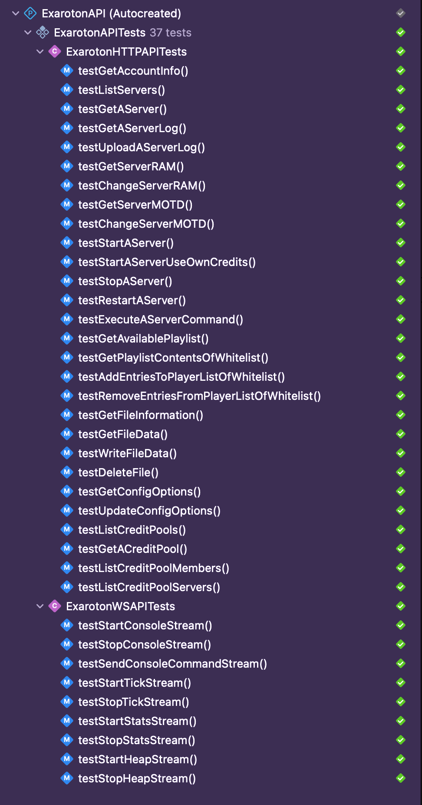

# ExarotonAPI

[](https://swiftpackageindex.com/wangzhizhou/ExarotonAPI) [](https://swiftpackageindex.com/wangzhizhou/ExarotonAPI)

[API][Exaroton API Website] for [Exaroton][Exaroton] in Swift

## Usage 🤩 

this swift package include products as follow:

1. **ExarotonHTTP**: httpclient which generated use the [swift-openapi-generator][Swift OpenAPI Generator] 
and [exaroton openapi spec][Exaroton OpenAPI Doc], you can view OpenAPI Spec with [Swagger Editor][Swagger Editor]

2. **ExarotonWebSocket**: websocket feature 

### HTTPClient

Add Dependency: `ExarotonHTTP`:

```swift

import PackageDescription

let package = Package(
    ...
    dependencies: [
        .package(url: "https://github.com/wangzhizhou/ExarotonAPI.git", branch: "main"),
    ],
    targets: [
        .target(
            name: "Your Target Name",
            dependencies: [
                .product(name: "ExarotonHTTP", package: "ExarotonAPI"),
                ...
            ]),
    ]
    ...
)

```

Use ExarotonHTTP:

```swift
import Foundation
import ExarotonHTTP
import OpenAPIRuntime
import OpenAPIURLSession

@main
struct HttpUsageDemo {
    static func main() async throws {
        let token = ProcessInfo.processInfo.environment["TOKEN"] ?? ""
        let serverId = ProcessInfo.processInfo.environment["SERVER"] ?? ""
        guard !token.isEmpty else {
            print("Missing env TOKEN. Example: TOKEN=... swift run HTTPUsageDemo")
            return
        }

        let client = Client(
            serverURL: try! Servers.Server1.url(),
            transport: URLSessionTransport(),
            middlewares: [AuthenticationMiddleware(token: token)]
        )
        let accountResponse = try await client.getAccount()

        switch accountResponse {
        case .ok(let ok):
            let account = try ok.body.json.data
            print("Account: \(account?.name ?? "-")")
        case .forbidden(let forbidden):
            let json = try forbidden.body.json
            print("Forbidden: \(json.error ?? "-")")
        case .undocumented(let statusCode, let unknownPayload):
            print("Unexpected status: \(statusCode), payload: \(unknownPayload)")
        }

        let serversResponse = try await client.getServers()
        switch serversResponse {
        case .ok(let ok):
            let servers = try ok.body.json.data ?? []
            print("Servers: \(servers.count)")
            if let first = servers.first {
                print("First server: \(first.id ?? "-") \(first.name ?? "-") status=\(first.status?.rawValue ?? -1)")
            }
        case .badRequest(let badRequest):
            let json = try badRequest.body.json
            print("Bad request: \(json.error ?? "-")")
        case .forbidden(let forbidden):
            let json = try forbidden.body.json
            print("Forbidden: \(json.error ?? "-")")
        case .notFound(let notFound):
            let json = try notFound.body.json
            print("Not found: \(json.error ?? "-")")
        case .internalServerError(let internalServerError):
            let json = try internalServerError.body.json
            print("Internal error: \(json.error ?? "-")")
        case .undocumented(let statusCode, let unknownPayload):
            print("Unexpected status: \(statusCode), payload: \(unknownPayload)")
        }

        if !serverId.isEmpty {
            let serverResponse = try await client.getServer(path: .init(serverId: serverId))
            switch serverResponse {
            case .ok(let ok):
                let server = try ok.body.json.data
                print("Server: \(server?.id ?? "-") \(server?.name ?? "-")")
            case .badRequest(let badRequest):
                let json = try badRequest.body.json
                print("Bad request: \(json.error ?? "-")")
            case .notFound(let notFound):
                let json = try notFound.body.json
                print("Not found: \(json.error ?? "-")")
            case .forbidden(let forbidden):
                let json = try forbidden.body.json
                print("Forbidden: \(json.error ?? "-")")
            case .internalServerError(let internalServerError):
                let json = try internalServerError.body.json
                print("Internal error: \(json.error ?? "-")")
            case .undocumented(let statusCode, let unknownPayload):
                print("Unexpected status: \(statusCode), payload: \(unknownPayload)")
            }
        } else {
            print("Tip: set env SERVER=... to query a specific server.")
        }
    }
}

```

For More Use Cases:

- 👉🏻 [http client unittests][openapi http client cases]

### WebSocketClient

Add Dependency: `ExarotonWebSocket`:

```swift

import PackageDescription

let package = Package(
    ...
    dependencies: [
        .package(url: "https://github.com/wangzhizhou/ExarotonAPI.git", branch: "main"),
    ],
    targets: [
        .target(
            name: "Your Target Name",
            dependencies: [
                .product(name: "ExarotonWebSocket", package: "ExarotonAPI"),
                ...
            ]),
    ]
    ...
)

```

Note:
- `ExarotonWebSocketAPI.delegate` is `weak`. Keep a strong reference to your handler (e.g. store it as a property), otherwise callbacks may stop unexpectedly.

Use ExarotonWebSocket:

```swift
import Foundation
import ExarotonWebSocket
import Starscream

@main
struct WebSocketUsageDemo {

    static func main() async throws {
        let token = ProcessInfo.processInfo.environment["TOKEN"] ?? ""
        let serverId = ProcessInfo.processInfo.environment["SERVER"] ?? ""
        guard !token.isEmpty, !serverId.isEmpty else {
            print("Missing env TOKEN or SERVER. Example: TOKEN=... SERVER=... swift run WebSocketUsageDemo")
            return
        }

        let ready = ReadySignal()
        let handler = ServerEventHandler(ready: ready)
        let socket = ExarotonWebSocketAPI(token: token, serverId: serverId, delegate: handler)

        socket.connect()

        let didBecomeReady = await ready.wait(seconds: socket.timeout)
        guard didBecomeReady else {
            print("Timed out waiting for ready")
            socket.disconnect()
            return
        }

        try socket.startStream(.console, tail: 10) {
            print("console stream start sent")
        }

        try socket.sendConsoleCommand("say Hello from WebSocketUsageDemo") {
            print("console command sent")
        }

        try await sleep(seconds: 3)
        try socket.stopStream(.console) {
            print("console stream stop sent")
        }

        try await sleep(seconds: 1)
        socket.disconnect()
    }

    static func sleep(seconds: Double) async throws {
        let ns = UInt64(max(0, seconds) * 1_000_000_000)
        try await Task.sleep(nanoseconds: ns)
    }
}

actor ReadySignal {
    private var continuation: CheckedContinuation<Void, Never>?
    private var isSignaled = false

    func signal() {
        isSignaled = true
        continuation?.resume()
        continuation = nil
    }

    func wait(seconds: Double) async -> Bool {
        if isSignaled { return true }
        return await withTaskGroup(of: Bool.self) { group in
            group.addTask {
                await withCheckedContinuation { continuation in
                    Task { await self._install(continuation) }
                }
                return true
            }
            group.addTask {
                let ns = UInt64(max(0, seconds) * 1_000_000_000)
                try? await Task.sleep(nanoseconds: ns)
                return false
            }
            let result = await group.next() ?? false
            group.cancelAll()
            return result
        }
    }

    private func _install(_ continuation: CheckedContinuation<Void, Never>) {
        if isSignaled {
            continuation.resume()
            return
        }
        self.continuation = continuation
    }
}

final class ServerEventHandler: ExarotonServerEventHandlerProtocol {
    let ready: ReadySignal

    init(ready: ReadySignal) {
        self.ready = ready
    }

    func onReady(serverID: String?) {
        print("server ready: \(serverID ?? "")")
        Task { await ready.signal() }
    }

    func onConnected() {
        print("server connected")
    }

    func onDisconnected(reason: String?) {
        print("server disconnected: \(reason ?? "")")
    }

    func onKeepAlive() {
        print("server keep alive")
    }

    func onStatusChanged(_ info: ExarotonWebSocket.Server?) {
        if let info {
            print("status: \(info)")
        }
    }

    func onStreamStarted(_ stream: ExarotonWebSocket.StreamCategory?) {
        if let stream {
            print("stream started: \(stream)")
        }
    }

    func onStreamStopped(_ stream: StreamCategory?) {
        if let stream {
            print("stream stopped: \(stream)")
        }
    }

    func onConsoleLine(_ line: String?) {
        if let line {
            print("console line: \(line)")
        }
    }

    func onTick(_ tick: ExarotonWebSocket.Tick?) {
        if let tick {
            print("tick: \(tick)")
        }
    }

    func onStats(_ stats: ExarotonWebSocket.Stats?) {
        if let stats {
            print("stats: \(stats)")
        }
    }

    func onHeap(_ heap: ExarotonWebSocket.Heap?) {
        if let heap {
            print("heap: \(heap)")
        }
    }

    func onError(_ error: Error) {
        print("error: \(error.localizedDescription)")
    }

    func didReceive(event: Starscream.WebSocketEvent, client: any Starscream.WebSocketClient) {
    }
}
```
For More Use Cases:
- 👉🏻 [Send Message][websocket send message cases]
- 👉🏻 [Receive Message][websocket message receive handler]

## Development 👨🏻‍💻

If you want to contribute to this project, you can use your Mac device and install the Xcode`(>= 15.4)` to get start

Run shell command as follow to get the project and open it with xcode editor:

```bash
$ git clone https://github.com/wangzhizhou/ExarotonAPI.git
$ cd ExarotonAPI && xed .
```

when you open the project with Xcode, and the dependencies be pull to local, 
you can open the target schema:



add environment variables `TOKEN` `SERVER` `POOL` secrets of you into the schema



---

- **TOKEN**: The Exaroton Account Info for you to access your server

- **SERVER**: The Exaroton Server ID

- **POOL**: The Exaroton Credit Pool ID

---


Then you can run all this unit test with shortcut: `CMD+U`, 
or you can run tests from menu of `Product -> Test`

If things goes well, you will see the unittests run and success or fail as follow:




[Exaroton]: <https://exaroton.com>
[Exaroton API Website]: <https://developers.exaroton.com/>
[Exaroton OpenAPI Doc]: <https://developers.exaroton.com/openapi.yaml>
[Swagger Editor]: <https://editor-next.swagger.io/>
[Swift OpenAPI Generator]: <https://swiftpackageindex.com/apple/swift-openapi-generator>
[openapi http client cases]: <https://github.com/wangzhizhou/ExarotonAPI/blob/main/Tests/ExarotonHTTPTests/ExarotonHTTPUnitTests.swift>
[websocket send message cases]: <https://github.com/wangzhizhou/ExarotonAPI/blob/main/Sources/ExarotonWebSocket/ExarotonWebSocketAPI.swift>
[websocket message receive handler]: <https://github.com/wangzhizhou/ExarotonAPI/blob/main/Tests/ExarotonWebSocketTests/ExarotonWebSocketEventDelegateHandler.swift>
