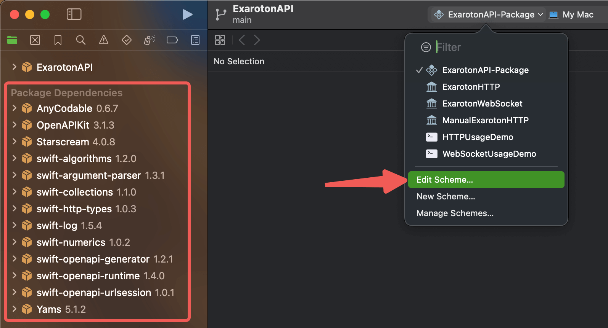

# ExarotonAPI

[API][Exaroton API Website] for [Exaroton][Exaroton] in Swift
## Usage 🤩 

```swift

import PackageDescription

let package = Package(
    ...
    dependencies: [
        .package(url: "https://github.com/wangzhizhou/ExarotonAPI.git", branch: "main"),
    ],
    targets: [
        .target(
            name: "Your Target Name",
            dependencies: [
                .product(name: "ExarotonAPI", package: "ExarotonAPI"),
                ...
            ]),
    ]
    ...
)

```

You can found http endpoint usage examples in the 👉🏻 [http cases][http] 👈🏻

You can found websocket usage example in the 👉🏻 [ws cases][ws send] and [event handler][ws receive] 👈🏻

## Developemnt 👨🏻‍💻

This SDK is generated by [swift-openapi-generator][Swift OpenAPI Generator] 
with [Exaroton OpenAPI Doc][Exaroton OpenAPI Doc]

You can use the [Swagger Editor][Swagger Editor] to view the OpenAPI Doc

If you want to contribute to this project, you can use your Mac device and install the Xcode`(>= 15.3)` to get start

Run shell command as follow to get the project and open it with xcode editor:

```bash
$ git clone https://github.com/wangzhizhou/ExarotonAPI.git
$ cd ExarotonAPI && xed .
```

when you open the project with Xcode, and the dependencies be pull to local, 
you can open the target schema:



add environment variables `TOKEN` `SERVER` `POOL` secrets of you into the schema


---

- **TOKEN**: The Exaroton Account Info for you to access your server

- **SERVER**: The Exaroton Server ID

- **POOL**: The Exaroton Credit Pool ID

---


Then you can run all this unit test with shortcut: `CMD+U`, 
or you can run tests from menu of `Product -> Test`

If things goes well, you will see the unittests run and success or fail as follow:


[Exaroton]: <https://exaroton.com>

[Exaroton API Website]: <https://developers.exaroton.com/>

[Exaroton OpenAPI Doc]: <https://developers.exaroton.com/openapi.yaml>

[Swagger Editor]: <https://editor-next.swagger.io/>

[Swift OpenAPI Generator]: <https://swiftpackageindex.com/apple/swift-openapi-generator>

[http]: <https://github.com/wangzhizhou/ExarotonAPI/blob/main/Tests/ExarotonAPITests/ExarotonHTTPAPITests.swift>
[ws send]: <https://github.com/wangzhizhou/ExarotonAPI/blob/main/Tests/ExarotonAPITests/ExarotonWSAPITests.swift>
[ws receive]: <https://github.com/wangzhizhou/ExarotonAPI/blob/main/Tests/ExarotonAPITests/WebSocketEventDelegateHandler.swift>
