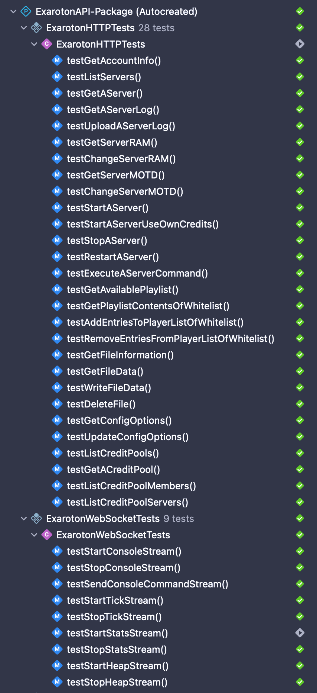

# ExarotonAPI

[](https://swiftpackageindex.com/wangzhizhou/ExarotonAPI) [](https://swiftpackageindex.com/wangzhizhou/ExarotonAPI)

[API][Exaroton API Website] for [Exaroton][Exaroton] in Swift

## Usage 🤩 

this swift package include products as follow:

1. **ExarotonHTTP**: httpclient which generated use the [swift-openapi-generator][Swift OpenAPI Generator] 
and [exaroton openapi spec][Exaroton OpenAPI Doc], you can view OpenAPI Spec with [Swagger Editor][Swagger Editor]

2. **ExarotonWebSocket**: websocket feature 

3. **ManualExarotonHTTP**: httpclient manually created for backup purpose, dont use it normally

### HTTPClient

Add Dependency: `ExarotonHTTP`:

```swift

import PackageDescription

let package = Package(
    ...
    dependencies: [
        .package(url: "https://github.com/wangzhizhou/ExarotonAPI.git", branch: "main"),
    ],
    targets: [
        .target(
            name: "Your Target Name",
            dependencies: [
                .product(name: "ExarotonHTTP", package: "ExarotonAPI"),
                ...
            ]),
    ]
    ...
)

```

Use ExarotonHTTP:

```swift
import Foundation
import ExarotonHTTP
import OpenAPIRuntime
import OpenAPIURLSession

@main
struct HttpUsageDemo {
    static func main() async throws {

        let yourAccountToken = ProcessInfo.processInfo.environment["TOKEN"] ?? ""

        let client = Client(
            serverURL: try! Servers.server1(),
            transport: URLSessionTransport(),
            middlewares: [AuthenticationMiddleware(token: yourAccountToken)]
        )
        let response = try await client.getAccount()

        switch response {
        case .ok(let ok):
            if let data = try ok.body.json.data,
               let name = data.name {
                print("account: \(name)")
            }
        case .forbidden(let forbidden):
            let json = try forbidden.body.json
            print(json.error ?? "")
        case .undocumented(let statusCode, let unknownPayload):
            print("statusCode:\(statusCode), payload: \(unknownPayload)")
        }
    }
}

```

For More Use Cases:

- 👉🏻 [http client unittests][openapi http client cases]

### WebSocketClient

Add Dependency: `ExarotonWebSocket`:

```swift

import PackageDescription

let package = Package(
    ...
    dependencies: [
        .package(url: "https://github.com/wangzhizhou/ExarotonAPI.git", branch: "main"),
    ],
    targets: [
        .target(
            name: "Your Target Name",
            dependencies: [
                .product(name: "ExarotonWebSocket", package: "ExarotonAPI"),
                ...
            ]),
    ]
    ...
)

```

Use ExarotonWebSocket:

```swift
import Foundation
import ExarotonWebSocket
import Starscream

@main
struct WebSocketUsageDemo {

    static let handler = ServerEventHandler()

    static let socket = ExarotonWebSocketAPI(
        token: ProcessInfo.processInfo.environment["TOKEN"] ?? "your_account_token",
        serverId: ProcessInfo.processInfo.environment["SERVER"] ?? "your_server_id",
        delegate: handler
    )

    static func main() async throws {
        socket.client.connect()
        try await wait(for: socket.timeout)

        let consoleStreamMessage = ExarotonMessage(
            stream: .console,
            type: StreamType.start,
            data: ["tail": 2]
        )
        socket.client.write(stringData: try consoleStreamMessage.toData) {
            print("console stream start completed!")
        }

        try await wait(for: socket.timeout)
        socket.client.disconnect()
    }

    static func wait(for minutes: Double) async throws {
        try await Task.sleep(nanoseconds: UInt64(1_000_000_000 * minutes))
    }
}

final class ServerEventHandler: ExarotonServerEventHandlerProtocol {

    func onReady(serverID: String?) {
        print("server ready: \(serverID ?? "")")
    }

    func onConnected() {
        print("server connected")
    }

    func onDisconnected(reason: String?) {
        print("server disconnected: \(reason ?? "")")
    }

    func onKeepAlive() {
        print("server keep alive")
    }

    func onStatusChanged(_ info: ExarotonWebSocket.Server?) {
        if let info {
            print("status: \(info)")
        }
    }

    func onStreamStarted(_ stream: ExarotonWebSocket.StreamCategory?) {
        if let stream {
            print("stream started: \(stream)")
        }
    }
    
    func onStreamStopped(_ stream: StreamCategory?) {
        if let stream {
            print("stream stopped: \(stream)")
        }
    }    

    func onConsoleLine(_ line: String?) {
        if let line {
            print("console line: \(line)")
        }
    }

    func onTick(_ tick: ExarotonWebSocket.Tick?) {
        if let tick {
            print("tick: \(tick)")
        }
    }

    func onStats(_ stats: ExarotonWebSocket.Stats?) {
        if let stats {
            print("stats: \(stats)")
        }
    }

    func onHeap(_ heap: ExarotonWebSocket.Heap?) {
        if let heap {
            print("heap: \(heap)")
        }
    }

    // MARK: WebSocketDelegate
    func didReceive(event: Starscream.WebSocketEvent, client: any Starscream.WebSocketClient) {
        // all events, if you need process them your self
    }
}
```
For More Use Cases:
- 👉🏻 [Send Message][websocket send message cases]
- 👉🏻 [Receive Message][websocket message receive handler]

## Developemnt 👨🏻‍💻

If you want to contribute to this project, you can use your Mac device and install the Xcode`(>= 15.3)` to get start

Run shell command as follow to get the project and open it with xcode editor:

```bash
$ git clone https://github.com/wangzhizhou/ExarotonAPI.git
$ cd ExarotonAPI && xed .
```

when you open the project with Xcode, and the dependencies be pull to local, 
you can open the target schema:


add environment variables `TOKEN` `SERVER` `POOL` secrets of you into the schema


---

- **TOKEN**: The Exaroton Account Info for you to access your server

- **SERVER**: The Exaroton Server ID

- **POOL**: The Exaroton Credit Pool ID

---


Then you can run all this unit test with shortcut: `CMD+U`, 
or you can run tests from menu of `Product -> Test`

If things goes well, you will see the unittests run and success or fail as follow:




[Exaroton]: <https://exaroton.com>
[Exaroton API Website]: <https://developers.exaroton.com/>
[Exaroton OpenAPI Doc]: <https://developers.exaroton.com/openapi.yaml>
[Swagger Editor]: <https://editor-next.swagger.io/>
[Swift OpenAPI Generator]: <https://swiftpackageindex.com/apple/swift-openapi-generator>
[openapi http client cases]: <https://github.com/wangzhizhou/ExarotonAPI/blob/main/Tests/ExarotonHTTPTests/ExarotonHTTPTests.swift>
[websocket send message cases]: <https://github.com/wangzhizhou/ExarotonAPI/blob/main/Tests/ExarotonWebSocketTests/ExarotonWebSocketTests.swift>
[websocket message receive handler]: <https://github.com/wangzhizhou/ExarotonAPI/blob/main/Tests/ExarotonWebSocketTests/ExarotonWebSocketEventDelegateHandler.swift>
[manual create http client cases]: <https://github.com/wangzhizhou/ExarotonAPI/blob/main/Tests/ManualExarotonHTTPTests/ManualExarotonHTTPTests.swift>
